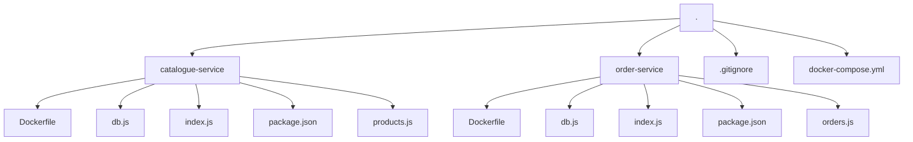

# Microservices E‑commerce (Node.js + Express)

Ce projet implémente un mini‑système de e‑commerce composé de deux microservices indépendants :

- **catalogue‑service** : gestion des produits  
- **order‑service** : création et consultation des commandes

Les deux services communiquent via HTTP (fetch natif), et sont packagés via Docker + docker‑compose.

---

## 🌳 Arborescence



---

## 🚀 Prérequis

- **Node.js** (version 18+ ou `latest`)  
- **npm**  
- **Docker** & **docker‑compose** (>= 1.29)

---

## 🛠 Installation & exécution locale

1.  **Cloner le dépôt**
    ```bash
    git clone <repo-url>
    ```
    ```bash
    cd <repo-root>
    ```

2.  **Installer les dépendances**

    Ouvrez deux terminaux distincts dans le répertoire racine du projet (`<repo-root>`).

    *   Dans le **premier terminal** :
        ```bash
        cd catalogue-service
        ```
        ```bash
        npm install
        ```
    *   Dans le **second terminal** :
        ```bash
        cd order-service
        ```
        ```bash
        npm install
        ```

3.  **Lancer les services**
    *   **En mode développement** (utilisez les deux terminaux ouverts précédemment) :

        *   Dans le **premier terminal** (pour `catalogue-service`) :
            ```bash
            npm start
            ```
        *   Dans le **second terminal** (pour `order-service`) :
            ```bash
            npm start
            ```

    *   **Avec Docker Compose** (depuis la racine du projet `<repo-root>`) :
        ```bash
        docker-compose up --build
        ```

---

⸻

📦 Liste des endpoints

1. catalogue‑service (port 8081)

Méthode	URL	Description
GET	/products	Liste tous les produits
GET	/products/:id	Récupère un produit par son ID
POST	/products	Crée un nouveau produit

Exemple de corps pour POST /products

{
    "id": 1,
    "name": "iPhone 15",
    "price": 999
}


⸻

2. order‑service (port 8082)

Méthode	URL	Description
POST	/orders	Crée une commande (corps = tableau d’IDs produit)
GET	/orders/:id	Récupère une commande par son ID

Exemple de corps pour POST /orders

[ 1, 2, 3 ]


⸻

🧪 Tests via curl

# 1) Ajouter un produit
```
curl -X POST http://localhost:8081/products \
  -H "Content-Type: application/json" \
  -d '{"name":"Nokia","price":699}'
```

# 2) Lister tous les produits
```
curl http://localhost:8081/products
```

# 3) Créer une commande (IDs de produits)
```
curl -X POST http://localhost:8082/orders \
  -H "Content-Type: application/json" \
  -d '[1,2]'
```
# 4) Récupérer une commande
```
curl http://localhost:8082/orders/1
```


⸻

## 🧪 Tests Unitaires & Intégration (Jest)

Des tests ont été mis en place à l'aide du framework [Jest](https://jestjs.io/) pour vérifier le bon fonctionnement de la logique métier des services.

### Installation et Configuration

1.  **Dépendance** : `jest` a été ajouté aux `devDependencies` de chaque microservice (`catalogue-service` et `order-service`) via `npm install --save-dev jest`.
2.  **Script NPM** : Un script `test` a été ajouté dans les fichiers `package.json` respectifs pour lancer les tests avec la commande `npm test`.
    ```json
    "scripts": {
      "start": "node index.js",
      "test": "node --experimental-vm-modules node_modules/jest/bin/jest.js"
    }
    ```
    *Note : L'option `--experimental-vm-modules` est nécessaire car le projet utilise les modules ES6 (`"type": "module"`).*

### Type de Tests

Initialement, des tests unitaires utilisant des *mocks* (simulations) de la base de données étaient envisagés. Cependant, la configuration actuelle utilise des **tests d'intégration**. Cela signifie que les tests interagissent directement avec les **vraies bases de données SQLite** (`catalogue.db`, `order.db`) pour vérifier le comportement des fonctions dans des conditions plus proches de la réalité.

### Structure des Tests

-   Les fichiers de test sont nommés `*.test.js` (par exemple, `products.test.js`, `orders.test.js`) et sont situés à la racine de chaque service.
-   Ils utilisent les fonctions `describe` et `it` de Jest pour structurer les scénarios de test.
-   Des **hooks** Jest sont utilisés pour gérer l'état de la base de données :
    -   `beforeAll` : Récupère la connexion à la base de données une seule fois avant tous les tests du fichier.
    -   `beforeEach` : Vide les tables concernées avant chaque test pour garantir l'isolation.
    -   `afterAll` : Vide les tables une dernière fois après tous les tests.

⸻


🐳 Docker & docker‑compose

Le fichier `docker-compose.yml` se trouve à la racine du projet et configure les services suivants :

*   **catalogue** :
    *   Construit à partir du dossier `./catalogue-service`.
    *   Exposé sur `localhost:8081`.
*   **order** :
    *   Construit à partir du dossier `./order-service`.
    *   Exposé sur `localhost:8082`.
    *   Configuré pour communiquer avec le service `catalogue` via l'URL `http://catalogue:8081` (grâce à la variable d'environnement `CATALOGUE_URL`).

Voici le contenu du fichier `docker-compose.yml` :

```yaml
version: "3.8"
services:
  catalogue:
    build: ./catalogue-service
    ports:
      - "8081:8081"

  order:
    build: ./order-service
    ports:
      - "8082:8082"
    environment:
      - CATALOGUE_URL=http://catalogue:8081
```